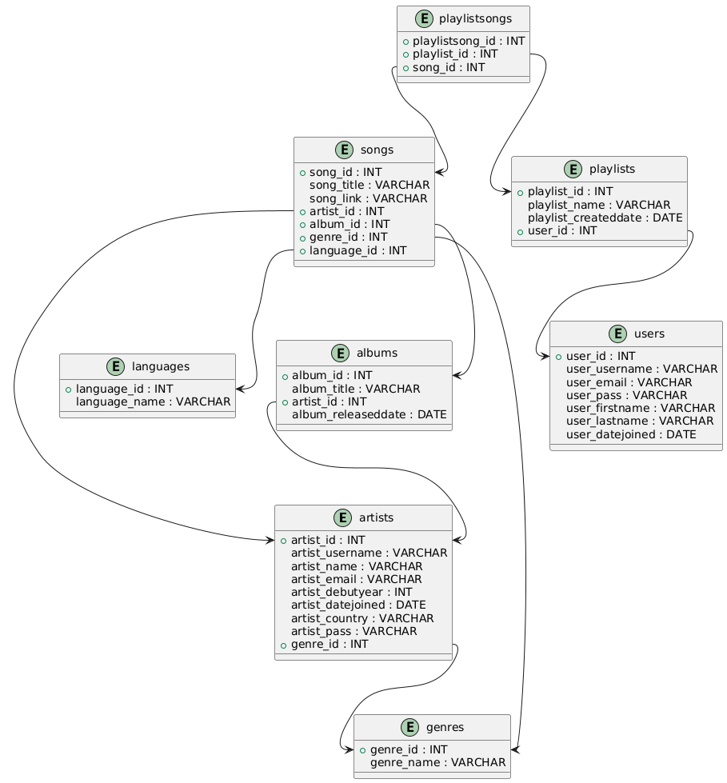

# 🎵 **Music Library Management System - Backend**  

This repository contains the **backend** of the **Music Library Management System**, developed using **Java**. The backend handles all the business logic and communicates with the **MySQL database** to provide a seamless user experience.  

---

## ✨ **Features**  
- **User & Artist Account Management** with OTP-based verification.  
- **Song Management**: Add, edit, delete, and play songs.  
- **Playlist & Album Management**: Create and manage playlists and albums.  
- **Profile Management**: Update personal details and delete accounts.  

---

## ⚙️ **Setup Instructions**  

### 1️⃣ **Prerequisites**  
- Java Development Kit (JDK)  
- MySQL Server  
- IDE (e.g., IntelliJ IDEA, Eclipse, Netbeans)  

### 2️⃣ **Database Configuration**  
- Before running the project, ensure that you have created the database tables as shown in the ER diagram below:  

  

### 3️⃣ **Edit Configuration Files**  

1. **Database Connection**  
   Open the `DatabaseConnection` file and replace the placeholders with your database details:  
   ```java
   String url = "jdbc:mysql://localhost:3306/<your_database_name>";
   String username = "<your_database_username>";
   String password = "<your_database_password>";

## 📌 **Frontend Repository**

   https://github.com/muhammadraza30/Web-Music-Library-Management-System-FrontEnd
